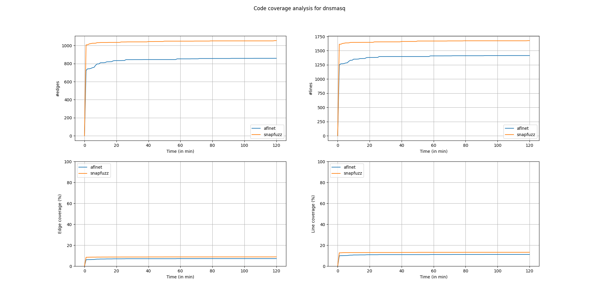
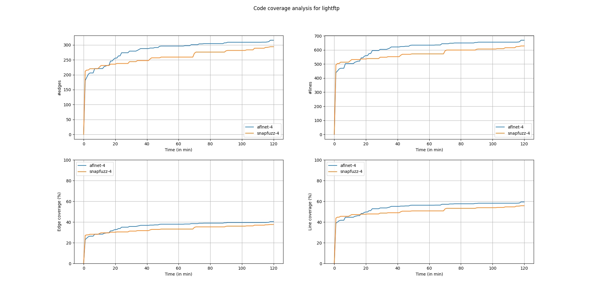
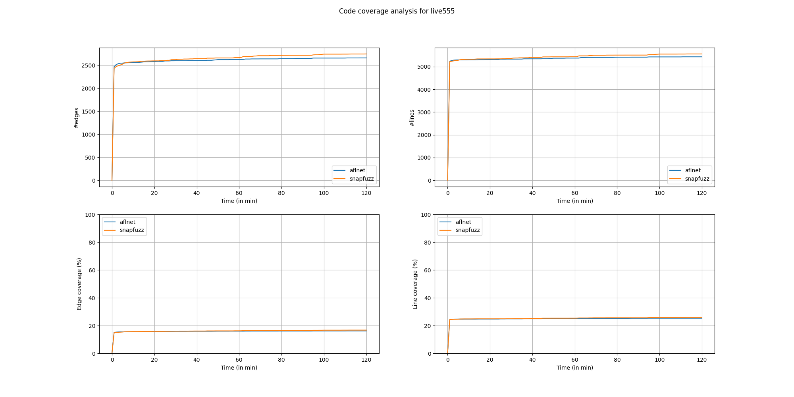
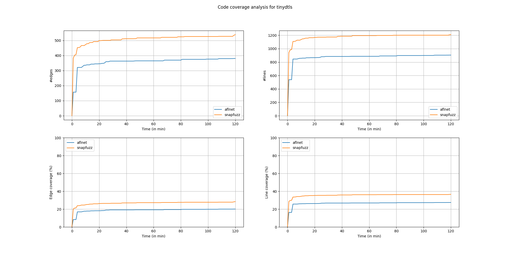

# Dnsmasq

| fuzzer     | run_no  | time_spent | total_execs | ave_execs_per_sec | b_cov_percent | l_cov_percent |
|------------|--------:|-----------:|------------:|------------------:|--------------:|--------------:|
| aflnet-4   | 1       | 7196.00    | 49480.00    | 6.88              | 6.90          | 10.70         |
| aflnet-4   | 2       | 7196.00    | 43456.00    | 6.04              | 7.10          | 11.10         |
| aflnet-4   | 3       | 7196.00    | 35832.00    | 4.98              | 6.90          | 10.70         |
| aflnet-4   | 4       | 7196.00    | 56196.00    | 7.81              | 7.70          | 11.70         |
| snapfuzz-4 | 1       | 7196.00    | 1746937.00  | 242.77            | 8.90          | 13.30         |
| snapfuzz-4 | 2       | 7196.00    | 1945040.00  | 270.29            | 9.00          | 13.50         |
| snapfuzz-4 | 3       | 7196.00    | 1906829.00  | 264.98            | 8.80          | 13.20         |
| snapfuzz-4 | 4       | 7196.00    | 1587208.00  | 220.57            | 8.80          | 13.20         |
| aflnet-4   | average | 7196.00    | 46241.00    | 6.43              | 7.15          | 11.05         |
| snapfuzz-4 | average | 7196.00    | 1796503.50  | 249.65            | 8.88          | 13.30         |

Winning

# LightFTP

| fuzzer     | run_no  | time_spent | total_execs | ave_execs_per_sec | b_cov_percent | l_cov_percent |
|------------|--------:|-----------:|------------:|------------------:|--------------:|--------------:|
| aflnet-4   | 1       | 7196.00    | 42817.00    | 5.95              | 39.60         | 58.10         |
| aflnet-4   | 2       | 7195.00    | 41290.00    | 5.74              | 39.50         | 58.30         |
| aflnet-4   | 3       | 7196.00    | 44705.00    | 6.21              | 40.40         | 59.00         |
| aflnet-4   | 4       | 7195.00    | 59745.00    | 8.30              | 41.90         | 62.00         |
| snapfuzz-4 | 1       | 7195.00    | 10969.00    | 1.52              | 38.60         | 57.40         |
| snapfuzz-4 | 2       | 7196.00    | 13262.00    | 1.84              | 38.00         | 56.90         |
| snapfuzz-4 | 3       | 7195.00    | 13852.00    | 1.93              | 37.20         | 55.00         |
| snapfuzz-4 | 4       | 7196.00    | 12980.00    | 1.80              | 36.60         | 53.50         |
| aflnet-4   | average | 7195.50    | 47139.25    | 6.55              | 40.35         | 59.35         |
| snapfuzz-4 | average | 7195.50    | 12765.75    | 1.77              | 37.60         | 55.70         |

Something is up, as were slower here.

# Live555

| fuzzer     | run_no  | time_spent | total_execs | ave_execs_per_sec | b_cov_percent | l_cov_percent |
|------------|--------:|-----------:|------------:|------------------:|--------------:|--------------:|
| aflnet-4   | 1       | 7195.00    | 89736.00    | 12.47             | 16.40         | 25.50         |
| aflnet-4   | 2       | 7195.00    | 90593.00    | 12.59             | 16.00         | 25.00         |
| aflnet-4   | 3       | 7195.00    | 97907.00    | 13.61             | 16.70         | 25.80         |
| aflnet-4   | 4       | 7196.00    | 101340.00   | 14.08             | 16.70         | 25.90         |
| snapfuzz-4 | 1       | 7195.00    | 343787.00   | 47.78             | 17.00         | 26.20         |
| snapfuzz-4 | 2       | 7195.00    | 409820.00   | 56.96             | 16.20         | 25.30         |
| snapfuzz-4 | 3       | 7196.00    | 388156.00   | 53.94             | 16.80         | 26.00         |
| snapfuzz-4 | 4       | 7196.00    | 340398.00   | 47.30             | 16.60         | 25.90         |
| aflnet-4   | average | 7195.25    | 94894.00    | 13.19             | 16.45         | 25.55         |
| snapfuzz-4 | average | 7195.50    | 370540.25   | 51.50             | 16.65         | 25.85         |

We're 5x faster, but it gains us nothing.

# TinyDTLS

| fuzzer     | run_no  | time_spent | total_execs | ave_execs_per_sec | b_cov_percent | l_cov_percent |
|-----------:|--------:|-----------:|------------:|------------------:|--------------:|--------------:|
| aflnet-4   | 1       | 3500.00    | 9391.00     | 2.68              | 20.50         | 27.60         |
| aflnet-4   | 2       | 7196.00    | 18664.00    | 2.59              | 27.50         | 40.90         |
| aflnet-4   | 3       | 7196.00    | 19236.00    | 2.67              | 19.80         | 27.20         |
| aflnet-4   | 4       | 7196.00    | 17142.00    | 2.38              | 19.80         | 27.30         |
| snapfuzz-4 | 1       | 7196.00    | 1113665.00  | 154.76            | 26.20         | 33.80         |
| snapfuzz-4 | 2       | 7195.00    | 1361670.00  | 189.25            | 30.80         | 43.10         |
| snapfuzz-4 | 3       | 7196.00    | 1235091.00  | 171.64            | 25.20         | 33.10         |
| snapfuzz-4 | 4       | 7196.00    | 1248339.00  | 173.48            | 27.20         | 34.00         |
| aflnet-4   | average | 6272.00    | 16108.25    | 2.58              | 21.90         | 30.75         |
| snapfuzz-4 | average | 7195.75    | 1239691.25  | 172.28            | 27.35         | 36.00         |

Doing well again.
