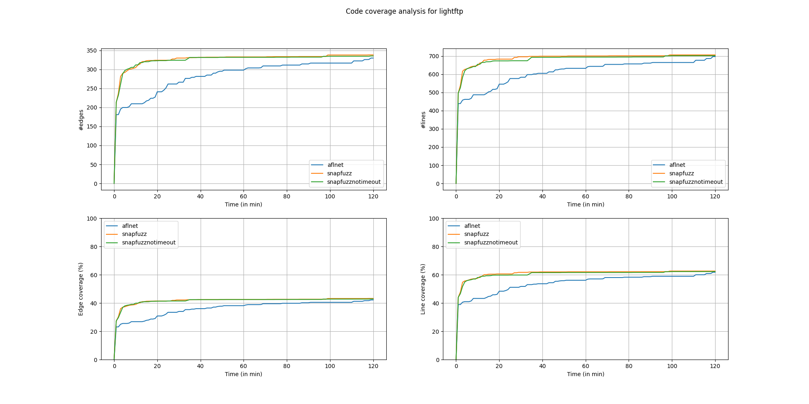

# Dnsmasq


| fuzzer   | run_no  | time_spent | total_execs | ave_execs_per_sec | b_cov_percent | l_cov_percent |
|---------:|--------:|-----------:|------------:|------------------:|--------------:|--------------:|
| aflnet   | 1       | 7196.00    | 37182.00    | 5.17              | 7.20          | 11.20         |
| aflnet   | 2       | 7196.00    | 42758.00    | 5.94              | 7.20          | 11.20         |
| aflnet   | 3       | 7196.00    | 36032.00    | 5.01              | 7.20          | 11.20         |
| aflnet   | 4       | 7196.00    | 52825.00    | 7.34              | 7.10          | 11.00         |
| snapfuzz | 1       | 7196.00    | 1853886.00  | 257.63            | 8.80          | 13.20         |
| snapfuzz | 2       | 7196.00    | 1989138.00  | 276.42            | 8.70          | 13.00         |
| snapfuzz | 3       | 7196.00    | 1952049.00  | 271.27            | 9.00          | 13.40         |
| snapfuzz | 4       | 7196.00    | 1996292.00  | 277.42            | 8.80          | 13.30         |
| aflnet   | average | 7196.00    | 42199.25    | 5.86              | 7.18          | 11.15         |
| snapfuzz | average | 7196.00    | 1947841.25  | 270.68            | 8.82          | 13.23         |

Winning

# LightFTP




| fuzzer            | run_no  | time_spent | total_execs | ave_execs_per_sec | b_cov_percent | l_cov_percent |
|-------------------|---------|------------|-------------|-------------------|---------------|---------------|
| aflnet            | 1       | 7196.00    | 36570.00    | 5.08              | 41.90         | 61.90         |
| aflnet            | 2       | 7196.00    | 42099.00    | 5.85              | 40.80         | 59.10         |
| aflnet            | 3       | 7196.00    | 38651.00    | 5.37              | 43.10         | 63.10         |
| aflnet            | 4       | 7196.00    | 37753.00    | 5.25              | 42.80         | 63.00         |
| snapfuzz          | 1       | 7196.00    | 131262.00   | 18.24             | 45.30         | 64.60         |
| snapfuzz          | 2       | 7196.00    | 131902.00   | 18.33             | 43.20         | 63.20         |
| snapfuzz          | 3       | 7196.00    | 144742.00   | 20.11             | 43.40         | 63.20         |
| snapfuzz          | 4       | 7196.00    | 68395.00    | 9.50              | 41.00         | 59.40         |
| snapfuzznotimeout | 1       | 7196.00    | 232980.00   | 32.38             | 42.10         | 60.20         |
| snapfuzznotimeout | 2       | 7196.00    | 255951.00   | 35.57             | 43.50         | 63.70         |
| snapfuzznotimeout | 3       | 7196.00    | 225269.00   | 31.30             | 43.20         | 63.00         |
| snapfuzznotimeout | 4       | 7196.00    | 233634.00   | 32.47             | 42.70         | 62.00         |
| aflnet            | average | 7196.00    | 38768.25    | 5.39              | 42.15         | 61.77         |
| snapfuzz          | average | 7196.00    | 119075.25   | 16.55             | 43.23         | 62.60         |
| snapfuzznotimeout | average | 7196.00    | 236958.50   | 32.93             | 42.88         | 62.23         |

Now fixed with clock_nanosleep(2). One of the runs was realy bas for some reason.

# Live555


| fuzzer   | run_no  | time_spent | total_execs | ave_execs_per_sec | b_cov_percent | l_cov_percent |
|---------:|--------:|-----------:|------------:|------------------:|--------------:|--------------:|
| aflnet   | 1       | 7196.00    | 97958.00    | 13.61             | 16.10         | 25.10         |
| aflnet   | 2       | 7195.00    | 97937.00    | 13.61             | 16.20         | 25.20         |
| aflnet   | 3       | 7195.00    | 98315.00    | 13.66             | 16.50         | 25.90         |
| aflnet   | 4       | 7196.00    | 91626.00    | 12.73             | 15.80         | 24.80         |
| snapfuzz | 1       | 7196.00    | 317030.00   | 44.06             | 16.70         | 25.70         |
| snapfuzz | 2       | 7195.00    | 290039.00   | 40.31             | 16.20         | 25.50         |
| snapfuzz | 3       | 7195.00    | 334403.00   | 46.48             | 17.00         | 26.20         |
| snapfuzz | 4       | 7195.00    | 346680.00   | 48.18             | 16.90         | 25.90         |
| aflnet   | average | 7195.50    | 96459.00    | 13.41             | 16.15         | 25.25         |
| snapfuzz | average | 7195.25    | 322038.00   | 44.76             | 16.70         | 25.83         |

We're 4x faster, but it gains us practicly nothing.

# TinyDTLS


| fuzzer   | run_no  | time_spent | total_execs | ave_execs_per_sec | b_cov_percent | l_cov_percent |
|---------:|--------:|-----------:|------------:|------------------:|--------------:|--------------:|
| aflnet   | 1       | 7195.00    | 22656.00    | 3.15              | 19.90         | 27.30         |
| aflnet   | 2       | 7196.00    | 19323.00    | 2.69              | 19.90         | 27.30         |
| aflnet   | 3       | 7195.00    | 20998.00    | 2.92              | 20.50         | 27.80         |
| aflnet   | 4       | 7196.00    | 23132.00    | 3.21              | 19.90         | 27.30         |
| snapfuzz | 1       | 7196.00    | 1425273.00  | 198.06            | 27.30         | 34.20         |
| snapfuzz | 2       | 7195.00    | 1372218.00  | 190.72            | 28.00         | 34.60         |
| snapfuzz | 3       | 7196.00    | 1730920.00  | 240.54            | 31.50         | 43.40         |
| snapfuzz | 4       | 7195.00    | 1402205.00  | 194.89            | 26.70         | 34.00         |
| aflnet   | average | 7195.50    | 21527.25    | 2.99              | 20.05         | 27.43         |
| snapfuzz | average | 7195.50    | 1482654.00  | 206.05            | 28.38         | 36.55         |

Doing well again.

# Others

## DAAP/forked-daapd:
Blocked on `SYS_statfs` support.

<https://github.com/andronat/SaBRe/blob/4a41a5adaec89235e00adc5d339be308f5c8d57c/plugins/sbr-afl/main.c#L870>

## DICOM/Dcmtk
Segfaults misteriously

## Exim

Sabre exit(0)'s misteriously

## Kamaillo

Times out

## OpenSSH 

Fails to send pid accross

```
[+] Deferred forkserver binary detected.
[*] Attempting dry run with 'id:000000,orig:ssh.raw'...
[*] Spinning up the fork server...
[+] SaBRe handshake OK!
[+] All right - fork server is up.

[-] PROGRAM ABORT : Fork server is misbehaving (OOM?)
         Location : run_target(), afl-fuzz.c:3555
```

https://github.com/andronat/aflnet/blob/2e3fe8e543bc05143f150a305fdd1666e175e1cd/afl-fuzz.c#L3555